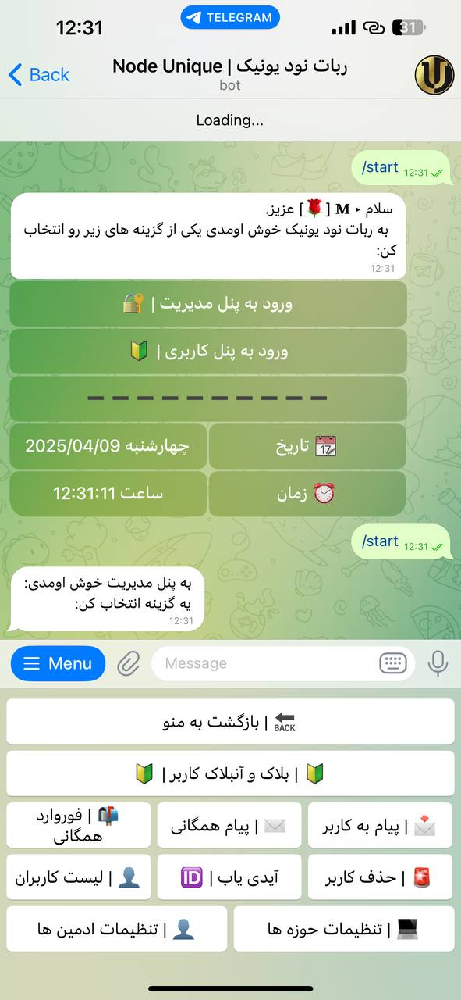
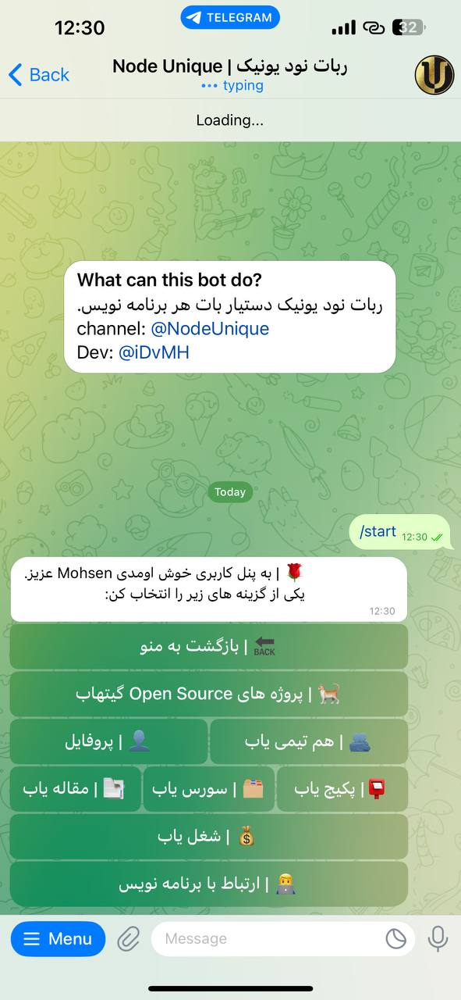

## NodeUniqueBot

### Built With

[](https://javascript.info/)
[](https://nodejs.org/en)


### Admin Panel

### User Panel

## Getting Started

### Installation

1. First Clone Repo:

   ```sh
   https://github.com/MhsnBakhshi/NodeUniqueBot
   ```

2. Install Packages:
   ```sh
   npm install
   or
   npm i
   ```

### ENV Variable Need Change

1.  `env file`

```js
 BOT_TOKEN = ?
```

### Example

```js
BOT_TOKEN = 7852489665:AAHkF462lzErDeCfq-O1I3N72KTI3WOnawc
```

## Folder Stracture

```
.
├── src
|   ├── scraping
|   |   ├── article-scrap.js.                               
|   |   ├── job-scraping.js.                               
|   |   ├── openSource-scrap.js.                               
|   |   ├── package-scrap.js.                               
│   |   └── source-scrap.js
│   ├── utils
|   |   ├── actions.js.                               
│   |   └── qurey.js              
│   ├── db.js                                
│   └── index.js                              
├── prisma
│   ├── migrations
│   └── schema.prisma
├── git
├── .env                   
├── .gitignore
├── node_modules
├── package-lock.json
├── package.json
├── README.md
```

## How Contribute In Project

1. Fork Repo
2. Clone Forked Repo.
3. Test And Add Your Feature
4. Commit Your Feature
5. Push
6. Send Pull Request

## Contact

- Telegram => https://t.me/iDvMH 90%
- Gmail => mhsn.bakhshi696@gmail.com 10%
